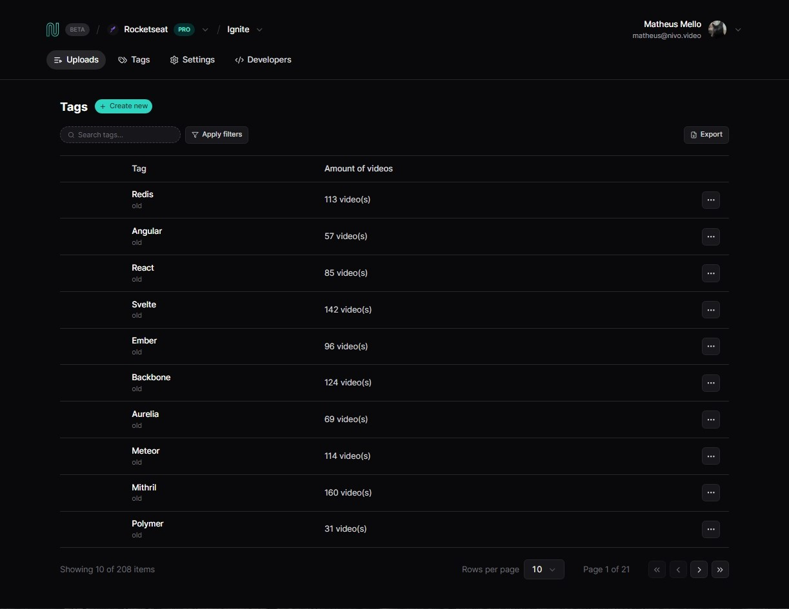

# React Data Listing

Desenvolvida em React, esta aplicação é baseada em uma lista de dados. Os usuários podem filtrar suas pesquisas por tags desejadas, buscando dados como likes e data. Além disso, eles têm a capacidade de adicionar uma nova tag à listagem. A aplicação inclui elementos como paginação, criação e filtros.

# Configurações 

### Requisitos
- [Node.js](https://nodejs.org/en/)
- [PNPM](https://pnpm.io/)

**Clone o projeto e acesse a pasta**

```bash
git clone git@github.com:matheusgmello/data-listing.gits && cd data-listing
```

**Siga estes passos**

- Instale as dependências(`pnpm install`)
- Rode o servidor(`pnpm run server`)
- Rode a aplicação(`pnpm run dev`)
- Acesse a aplicação(`localhost:5173`)

## Tecnologias 

- [React](https://react.dev/)
- [React-Query](https://tanstack.com/query/v3/)
- [Radix](https://www.radix-ui.com/)
- [Tailwind](https://tailwindcss.com/docs/installation)
- [JSON-Server](https://www.npmjs.com/package/json-server)

<!--START_SECTION:footer-->
<br />

## 🔗 Connect with me
[](https://linkedin.com/in/matheusgmello)
[](https://www.reddit.com/user/math7zw)
[](https://github.com/matheusgmello/)


<!--END_SECTION:footer-->
